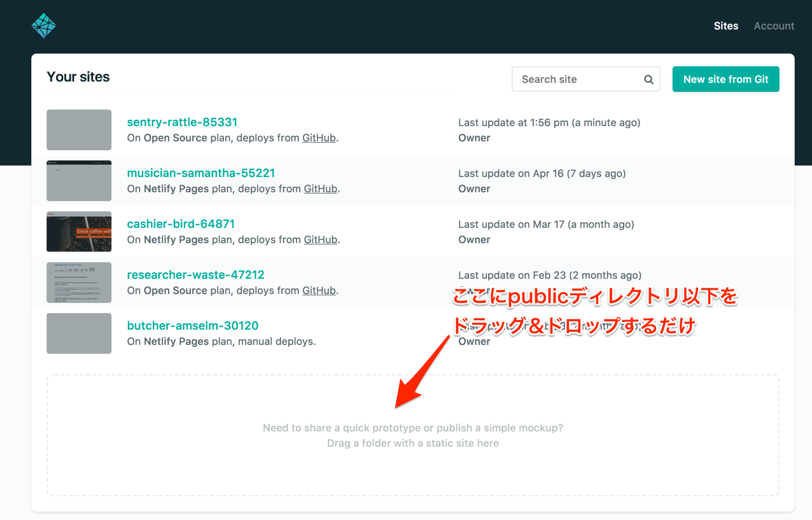

## おまけ

### [Step2]AWSリソースを`serverless.yml`で作成する
Serverless Frameworkでは、CloudFormation的な記法でAWSリソースを起動できます。
S3 Bucket作った例をQiitaに書いてるので、興味がある人は試してみてください。

- <a href="http://qiita.com/motchi0214/items/647ba31ce3e3af49b6eb" >Serverless FrameworkでS3Bucketを作成する - Qiita</a>

### [Step3]Serverless Frameworkで動的webサイトを配信する
API GatewayからHTMLを返す方法を利用して、Reactなどを使って動的にwebサイトを配信することもできます。
Express.jsつかうより楽なケースもあるかと思いますので、試してみてください。

- <a href="http://qiita.com/motchi0214/items/56b3780aa5884057fbd5" >Serverless Frameworkでwebページを作る - Qiita</a>
- <a href="http://qiita.com/motchi0214/items/f8944d0d21e53ed95ae1" >Serverless FrameworkでReactを使ったWordPress記事一覧ページを作る - Qiita</a>

### [Step2]デプロイを自動化する
Circle CIやTravis CI / CodeDeployを使ってデプロイを自動化することもできます。

- <a href="http://qiita.com/motchi0214/items/e95a87e732eb401b43e5" >CircleCIからServerless Frameworkのデプロイを実行する - Qiita</a>
- <a href="http://qiita.com/horike37/items/f0d7e1cf8139c9fb8302" >API Gateway+Lambda+Serverless+TravisでAPI開発のCI/CDパイプラインを構築する - Qiita</a>
- <a href="http://qiita.com/motchi0214/items/aceca576edf358cd988e" >CodePipelineでServerless Frameworkのデプロイを管理する - Qiita</a>

### [Step5]サイトを公開するには？

`npm run build`した後に`public/`ディレクトリ配下を公開サーバーにアップロードすればOKです。

ただしReact Routerの仕様上、全てのリクエストをindex.htmlにリダイレクトする必要があり、そのままS3にアップロードするだけでは死にます。

Netlify用のリダイレクトルールは設定されていますので、Netlifyの無料アカウントを利用されるのがよいかもしれません。
https://www.netlify.com/

### X-ray
X-rayも使えないことはないです。
- <a href="http://qiita.com/motchi0214/items/203163ddd27a2ae8f10d" >Serverless Frameworkで作ったLambdaにX-Rayのアクティブトレースを適用する - Qiita</a>

### 「もっと参考記事よこせ」という方へ
日本人のコアコミッターがQiitaに記事めっちゃ書いてるんで、それみましょう。
[@horike37](http://qiita.com/horike37)
