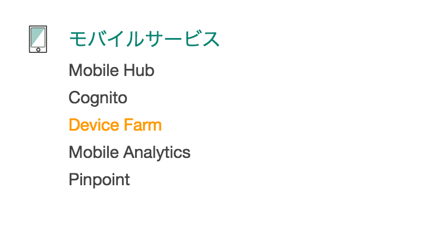
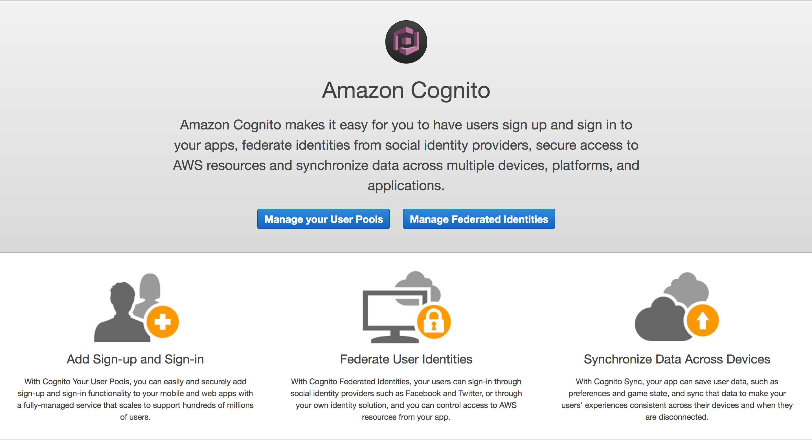
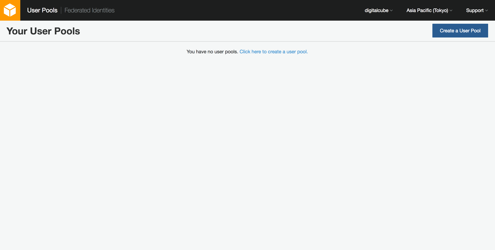
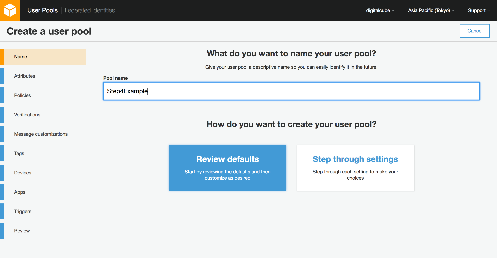
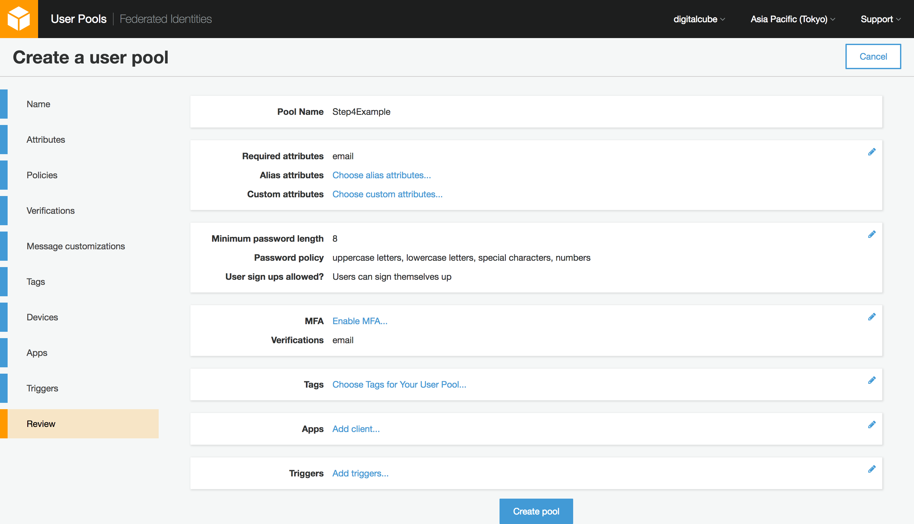
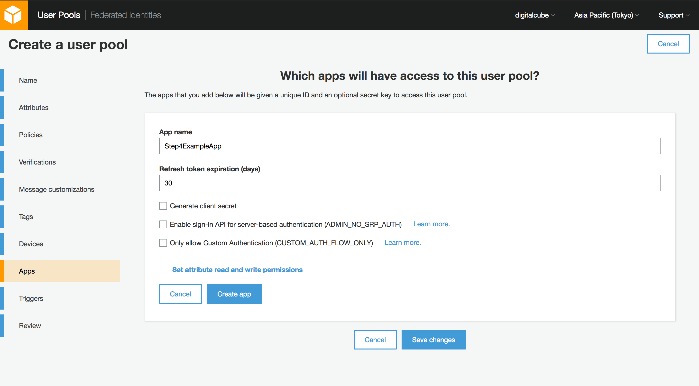
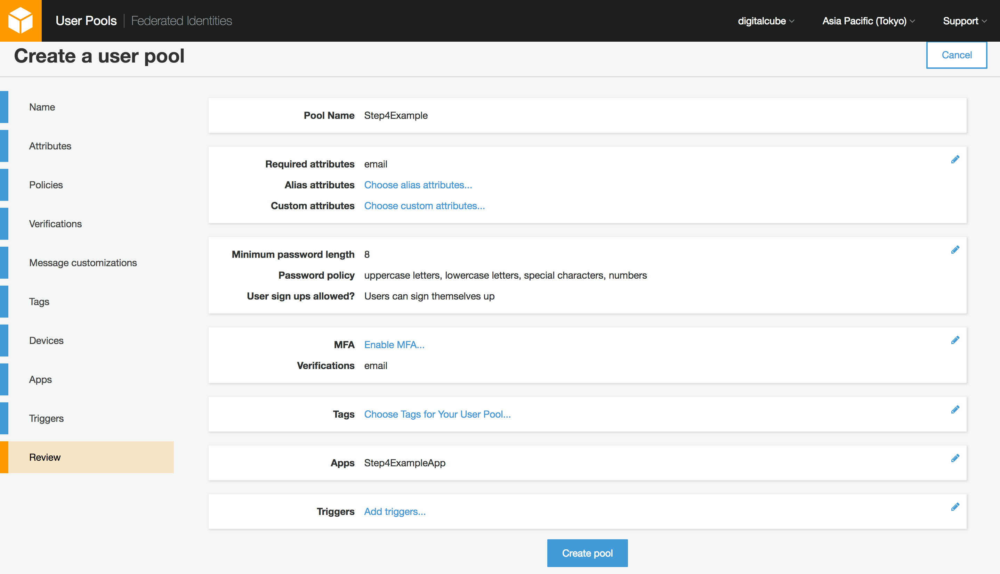
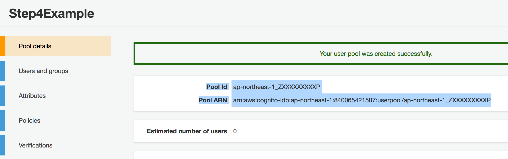
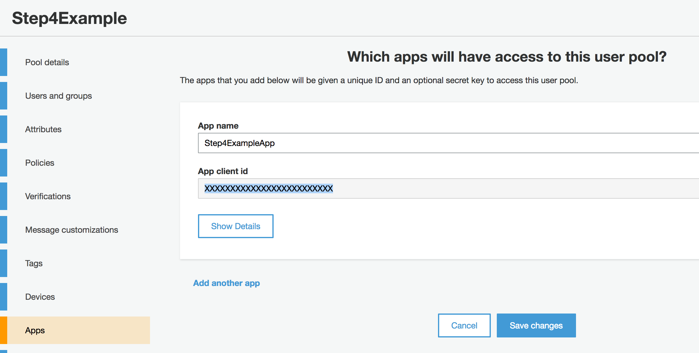

## ハンズオン４：Cognito UserPoolで会員登録基盤を作る

### Goal
Cognito UserPoolで会員登録基盤を作る
※ここではServerless Frameworkは使いません

### 1:コンソールを開く

Cognitoはモバイルサービスカテゴリ内にあります。

### 2:UserPoolを作る

#### UserPool管理画面へうつる

[Manage your User Pools]を選択すると、UserPool管理画面へうつります。

#### 新規作成する

[Create a User Pool]を選んで作成ウィザードを起動させます。

#### デフォルト設定を採用する

[Pool name]を入力し、[Review defaults]をクリックします。
[Step through settings]を選ぶと、全て自分で設定できます。

#### 確認画面から、アプリ用クライアント作成画面へ

Review画面です。[Apps]の[Add client]をクリックしましょう。

#### アプリ用クライアントの情報を入力

[App name]を入力しましょう。
[Generate client secret]を**必ずオフ**にしてください。
[Create app]をクリックしたのちに、[Save chages]をクリックします。

#### User Poolを作成する

先ほどの確認画面に戻るので、[Create Pool]をクリックします。

#### アプリに入力する情報を控える

[Pool Id]を控えましょう。

[App client id]を控えましょう。


### 3:Serverless Frameworkで使用するためのAPPを作る
`secret`をオフにしないとあとで泣く

### 4:会員登録画面のサンプルコードを取得する
ブラウザ上から実行できる会員登録ページのサンプルが、AWSのリポジトリにあります。
まずはこれを使って先ほど作ったUserPoolにユーザー登録してみましょう。

```
$ git clone git@github.com:aws/amazon-cognito-identity-js.git
$ cd amazon-cognito-identity-js/examples/babel-webpack/
```

### 5:サンプルコードをセットアップする
※この辺りから、React / webpackなどがでてきます
サンプルアプリとCognitoの接続設定をします。

```
$ vim src/config.js
export default {
  region: '{Cognito UserPoolを作ったリージョン}',
  IdentityPoolId: '{空欄でOK}',
  UserPoolId: '{Cognito UserPoolのPool Id}',
  ClientId: '{Cognito UserPoolで作ったApp client id}',
}
```

そのあとビルドを実行してからindex.htmlにアクセスしてみましょう。

```
$ npm install
$ npm run build
```

localhostでアクセスしたい場合は、`php -S localhost:8000`とかするとOK

#### ローカルで実行できない場合
`amazon-cognito-identity-js/examples/babel-webpack/`の中身をS3にアップロードして、静的ウェブサイトとして公開しましょう。
